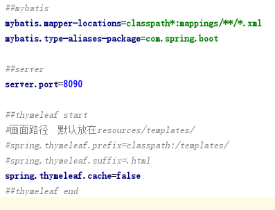

# Spring Boot + MyBatis + MySql + view(thymeleaf)

spring boot + mybatis + mysql + view(thymeleaf) 的基础例子，用于初学者学习spring boot

要完成简单的入门，只需要5步：

## 1.maven pom.xml 

    释：spring-boot-starter-web（web mvc）、spring-boot-starter-thymeleaf（thymeleaf解析引擎）、mybatis-spring-boot-starter（spring boot+mybatis结合版）、mysql-connector-java（mysql驱动）

## 2.entity、mapper、service、controller

    释：实体、持久、业务、控制器就不做详细的描述了。

## 3.mappings.xml

    释：mybatis对应的xml文件

## 4.application.properties的关键属性配置

本地开发建议关闭缓存

## 其余任何东西都不需要配置，只需要下载下来导入IDE就可以运行；

# 注：maven仓库需要另外配置